# WAREHOUSE

## Table of Contents

- [Project Overview](#project-overview)
- [Technologies](#technologies)
- [Usage](#usage)
- [Features](#features)
- [Getting Started](#getting-started)
  - [Installation](#installation)
  - [Configuration](#configuration)
  - [Run in Docker](#run-in-docker)
  - [Running the Development Server](#running-the-development-server)
- [Database](#database)
- [Testing](#testing)
- [Author](#author)

## Project Overview

This project is created to manage warehouse of medical equipment.
It is built using Django 4.1.7.
It is made especially for Medical Rescue Group of Polish Red Cross.
User can go by all containers in warehouse, create new containers
and add equipment into containers. Project includes also pre-created
list of equipment of different types of bags used in Group. 3rd part of
app is staff management.
All Create, Read, Update, Delete operations on models are available via API.

## Technologies:

the most important technologies used in the project:

- Python 3.11
- Django 4.2.6
- DjangoRestFramework 3.14.0
- PostgreSQL 16
- Docker 24.0.5
- Pre-commit 3.2.0
- Xhtml2pdf 0.2.11
- Crispy-bootstrap4 2022.1

## Usage

To enter into service you need to have user account. It's for safety reasons - information about some equipment and
calendar access may be sensitive. In main page you have menu and information about Group calendar, links into social media (FB, Instagram).

#### Main page

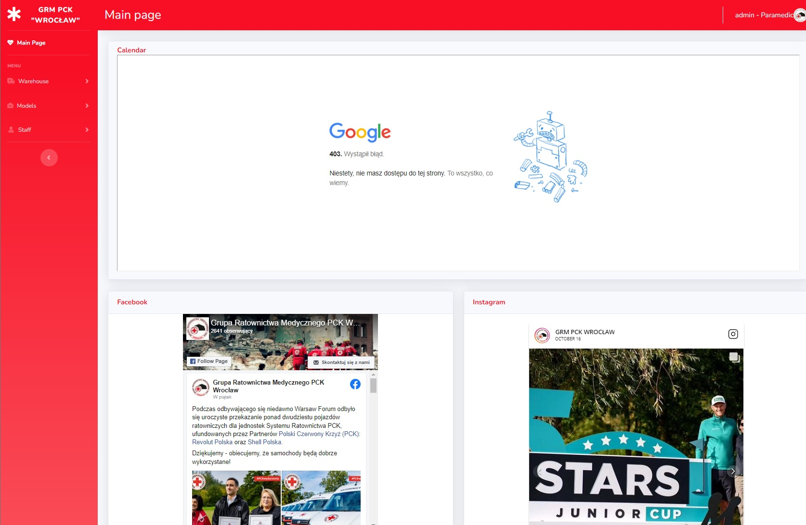
Main page - only users logged into Google account with permissions to calendar can see it.

#### Container page

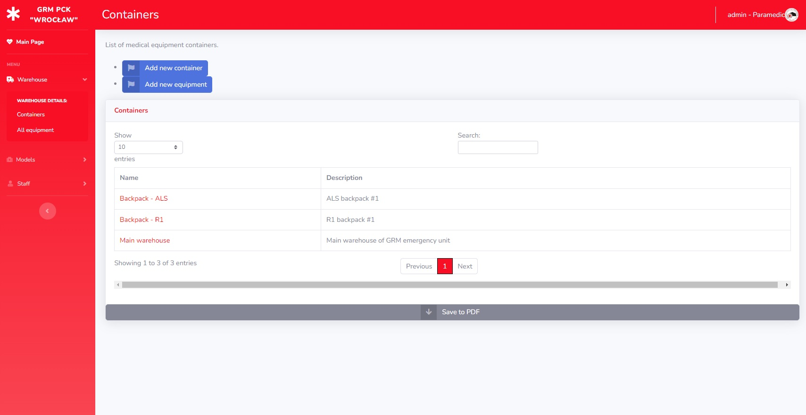
Container list. From this page user can create new container, add equipment or downlnoad pdf list of containers.

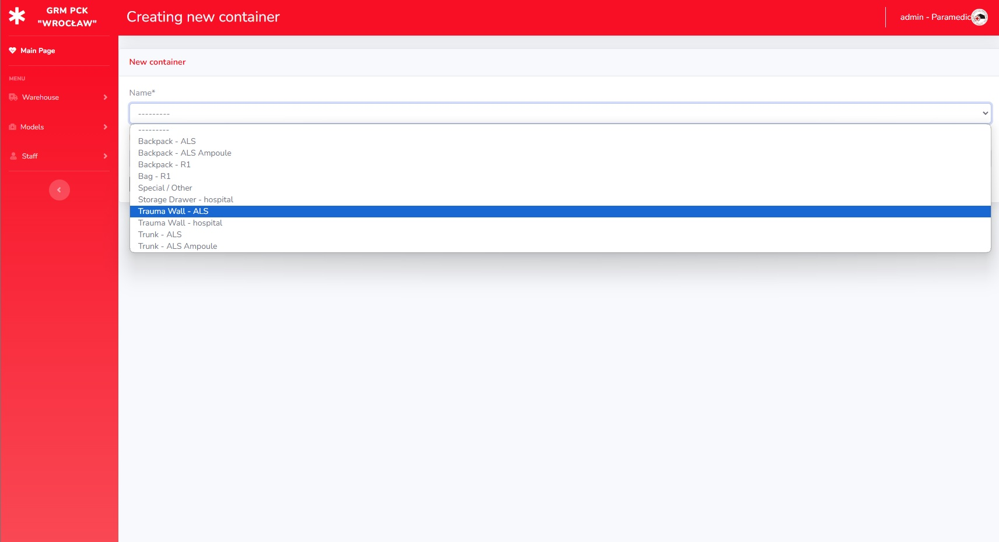
Creating new container. User can choose name form list and add own description.

#### Equipment page

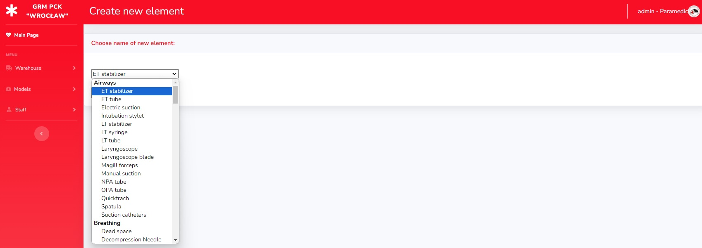
Add new equipment from list

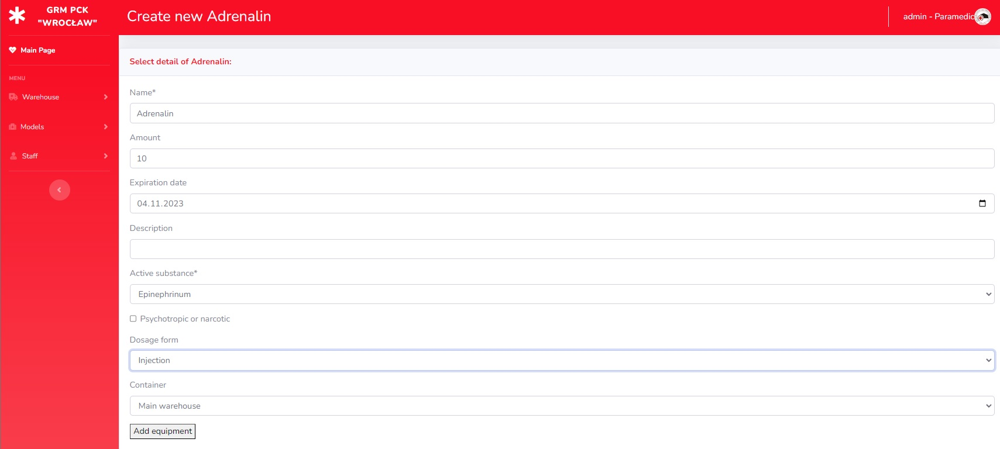
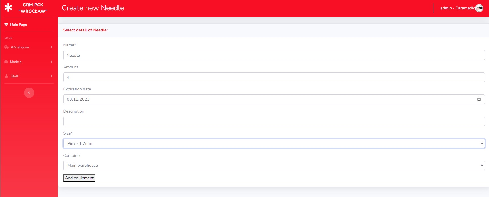
Depends on name of equipment, creates different model - with specific fields.

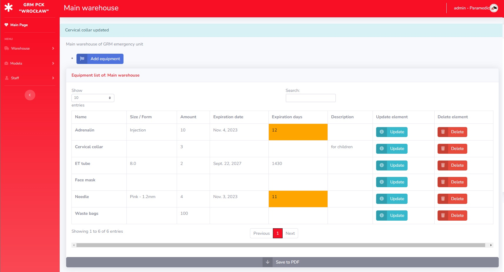
List of equipment from container. User can manage equipment and download equipment list of container.

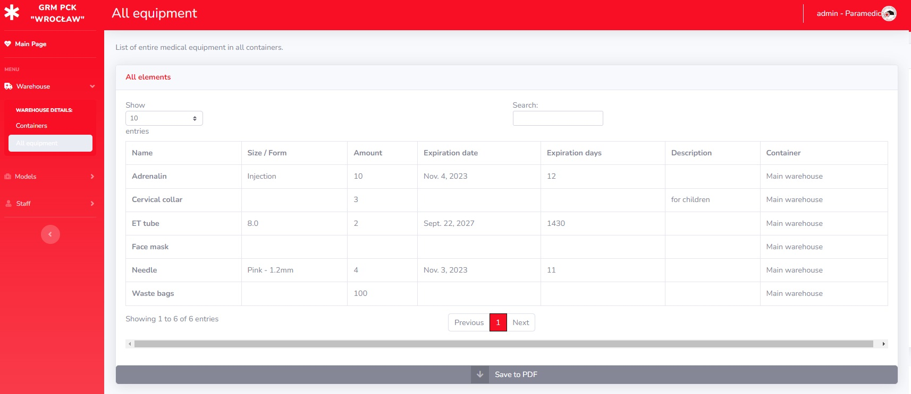
It's possible to get all equipment of all containers together.

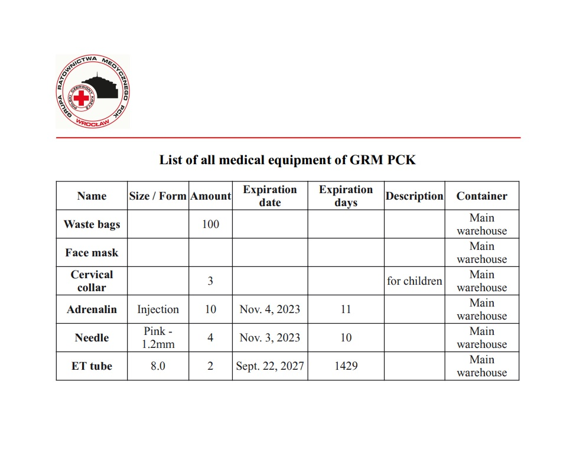
List of all equipment in pdf.

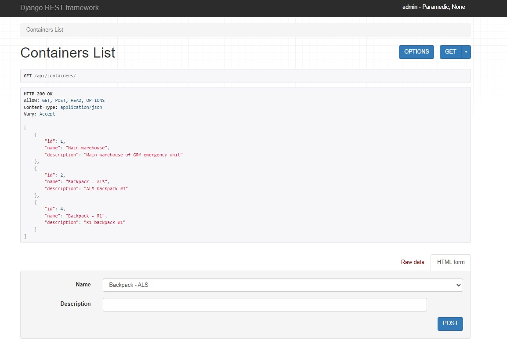
Example of API response of at "/api/containers/"

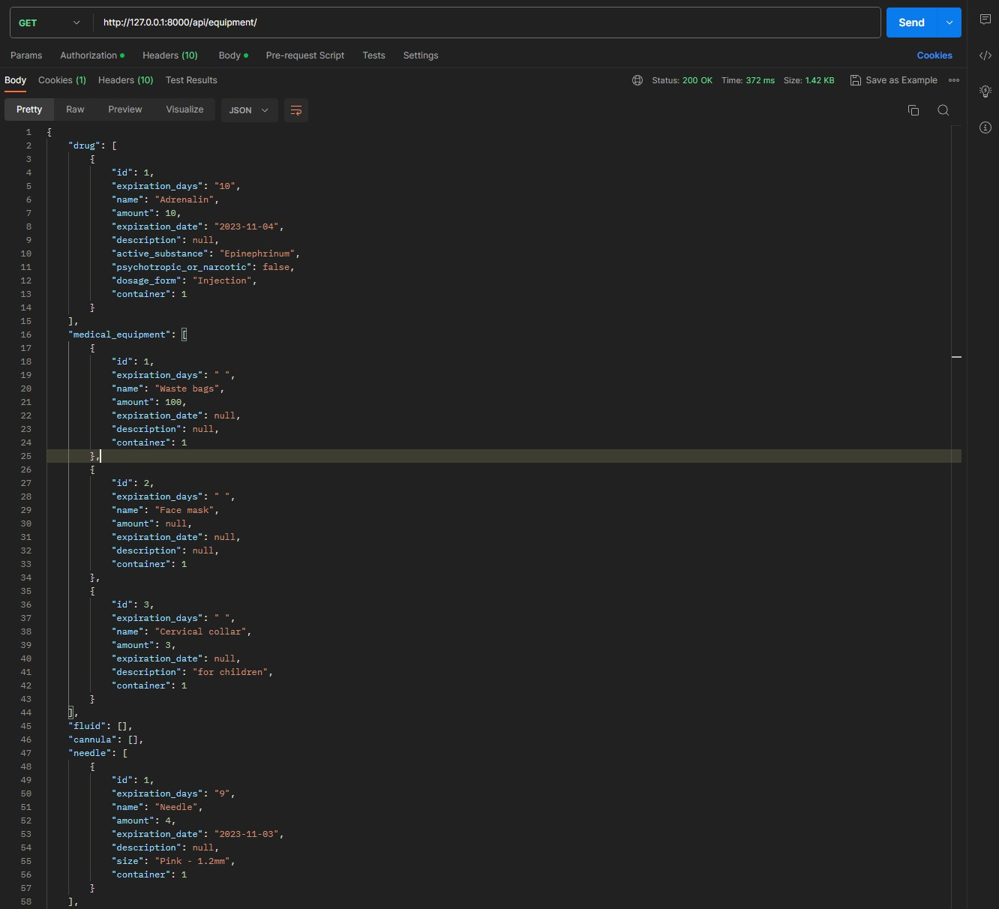
Example of API response of at "/api/equipment/"

## Features

- [Feature 1]: Containers - can manage different types of containers of list, ex. bags, trunks.
- [Feature 2]: Equipment - containers contain equipment. There is list of medical equipment to add sorted by types, ex. airways, drugs.
- [Feature 3]: Models - ready set of equipment. User can check what should be in, to make it in real.
- [Feature 4]: Staff - Different groups of Staff - to manage containers and equipment or for staff management.
- [Feature 5]: Save into pdf - every list (staff, containers, equipment, equipment in container) can be downloaded in pdf version.
- [Feature 6]: API - CRUD operations on models are available via API.

## Getting Started

Follow these steps to get your project up and running locally.

### Installation

1. Clone the repository:

   ```bash
   git clone https://github.com/SzymKam/warehouse
   cd src
   ```

2. Create a virtual environment (optional but recommended):

   ```bash
   python -m venv venv
   source venv/bin/activate  # On Windows, use `venv\Scripts\activate`
   ```

3. Install project dependencies:

   ```bash
   pip install -r requirements.txt
   ```

### Configuration

Configure your project by setting up environment variables:

- SECRET_KEY - default is randomly generated

Create local server of PostgreSQL, and set variables to connect:

- USER - database user
- PASSWORD - database user password
- HOST - database host
- NAME - database name

For reset user password via email, connect to email service:

- EMAIL_HOST_USER - user of email host
- EMAIL_HOST_PASSWORD - password to email host
- DEFAULT_FROM_EMAIL - email address to send mails

To help set local variables correctly, you can use ".env.dist" file. Copy this file as ".env" and set you variables values.

### Run in Docker

Make sure you have installed and running Docker engine. To run project:

```bash
docker compose up --build
```

### Running the Development Server

1. Run database migrations:

   ```bash
   python manage.py migrate
   ```

2. Create a superuser (admin):

   ```bash
   python manage.py createsuperuser
   ```

3. Start the development server:

   ```bash
   python manage.py runserver
   ```

Your Django project should now be accessible at [http://localhost:8000/].

## Database

Overview of the database structure and models:

- [Model 1]: Container - with fields: name and description. Default container is "Main warehouse" -
  auto-created when database migrate. Also, when delete other container, equipment is transferred into
  "Main warehouse".
- [Model 2]: StaffUser - inherits from Django AbstractUser. Add additional fields (position, medical_qualifications, qualifications_expiration_date, image).
  This model is used as default AuthUserModel.
- [Model 3]: BaseMedicalEquipment - base for medical equipment. It's not used separately. Other models inherit from it:
  Drug, MedicalEquipment, Fluid, Cannula, Needle, Syringe, BIG, LtTube, Gloves, SterileGloves, Gauze, NasopharyngealTube,
  OropharyngealTube, EndotrachealTube, LaryngoscopeBlade, OxygenMask, VentilationMask - each of them with specific fields.

## Testing

To run the tests for this project, use the following command:

```bash
python manage.py test
```

For testing is used included in Django - Unit Test.
Total test coverage is 99%, with 6466 Stmts and 45 Miss.

## Author

SzymKam

https://github.com/SzymKam
